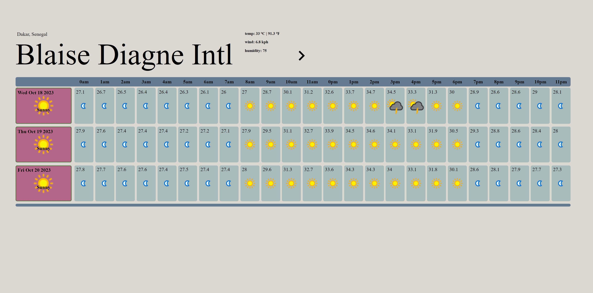
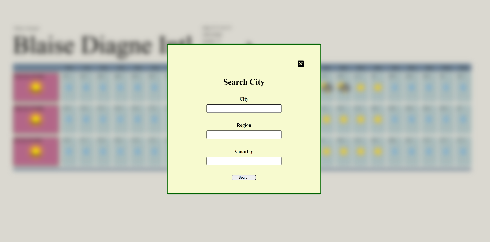

# Weather App

## Description
A 'TOP' Javascript course project which covers the implementation of 'Promise' based functions

### Three day 24 hour weather forecast

### Locate target city with form

### Page responds to different screen sizes

## JS lessons covered
- API data fetch and control
- Promise based functions:
  * async-await
  * fetch-then
  * promise-then

## Project Link
https://www.theodinproject.com/lessons/javascript-weather-app
